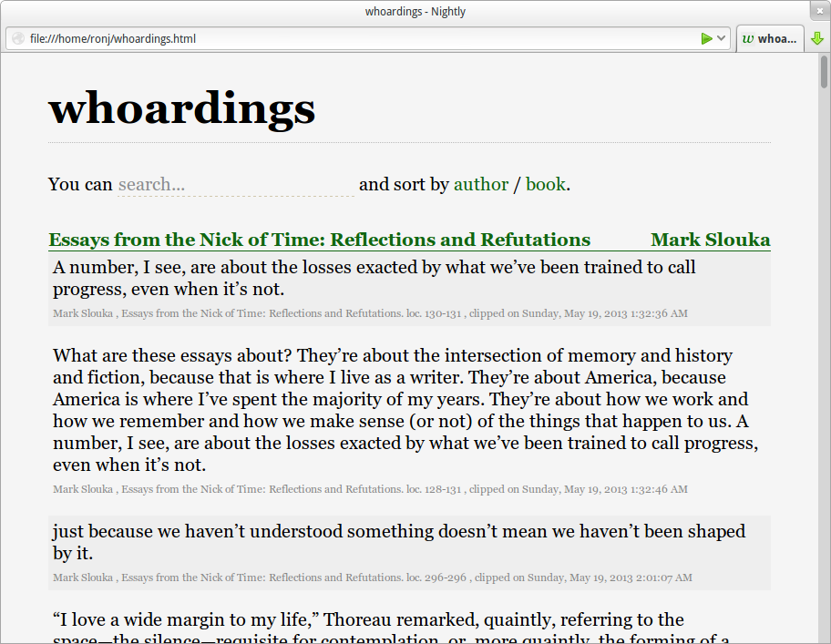

whoarder
========

**whoarder** converts your Kindle's `My Clippings.txt` file to a more pleasant, sortable, filterable HTML file:

Requirements
------------

- Python 3.3 (so far I only tested with 3.3 on Linux, tests and patches to increase compatibility very welcome)
- The `jinja2` and `chardet2` modules (install them from pip)
- Only tested on a `My Clippings.txt` file produced by a Kindle Paperwhite (ok/ko reports for other devices and test data welcome)
    - Kindle Fire & Kindle Fire HD are not supported, since they do note create the `My Clippings.txt` file. If you know where to dig that data for those versions, patches welcome.

Usage
--------------------

**Command-line**:

Run `whoarder.py /path/to/My Clippings.txt [destination]` . If `destination` is omitted, the output HTML will be written in the same place (overwriting any pre-existing HTML).

**As module**: 

    from clippings import Clippings
    clippings = Clippings(args.source, args.destination)  # contains a 'clippings' dict containing the information
    clippings.export_clippings()  # exports as HTML

**Tests**:

Some unit tests are in `test.py`, along with sample data in `test.txt`.

Similar Software
----------------

- Web services
    - [Clippings Converter](http://www.clippingsconverter.com/)
    - [Clipper](http://www.claybavor.com/clipper/)
- Offline
    - (PHP) [kindle-split-by-book](https://gist.github.com/elvisciotti/1783585)

License and contact
-------------------

Licensed under the BSD license, 2013, [ronan@jouchet.fr](mailto:ronan@jouchet.fr) / [@ronjouch](https://twitter.com/ronjouch)